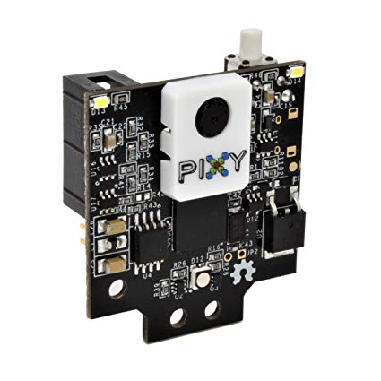
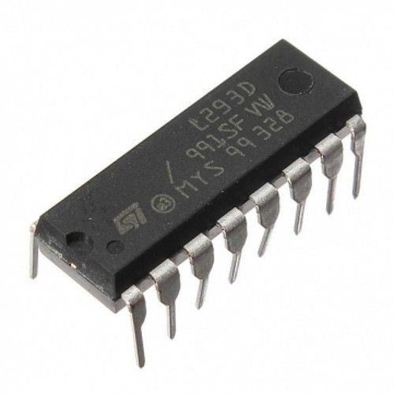

# Vélbúnaður

## Partar í keppni

| Búnaður						| Spenna	| Stykkjatala	|
| ---							| ---:		| :---:			|
| Arduino Mega 2560				| 			| 1				|
| Rev Core Hex Motor			| 12V		| 4				|
| Rev 12V Battery				| 12V		| 1				|
| Breadboard					|			| 2				|
| Pixy2 Camera					| 5V		| 1				|
| Custom Wheel					|			| 4				|
| Custom Body					|			| 1				|
| 12V Battery Power Connector	|			| 2				|
| Motor Power Cable				|			| 4				|
| Rev Axle						|			| 4				|
| Rev Shaft Collar				|			| 8				|
| Electrical Tape				|			| ∞				|
| Rev High Strength Hex Hub		|			| 4				|
| Custom 3D Printed Parts		|			| ?				|
| M2M Wire						|			| ?				|
| F2M Wire						|			| ?				|
| F2F Wire						|			| ?				|

## Partar sem voru ekki í keppni

| Búnaður							| Spenna	| Stykkjatala	|
| ---								| ---:		| :---:			|
| Joystick							|			| 1				|
| Arduino Uno						|			| 1				|
| Arduino Wireless Proto Shield		|			| 2				|
| XBee Pro S1						|			| 2				|
| 9V Battery						| 9V		| 2				|
| Custom 3D Printed Controller Case	|			| 1				|