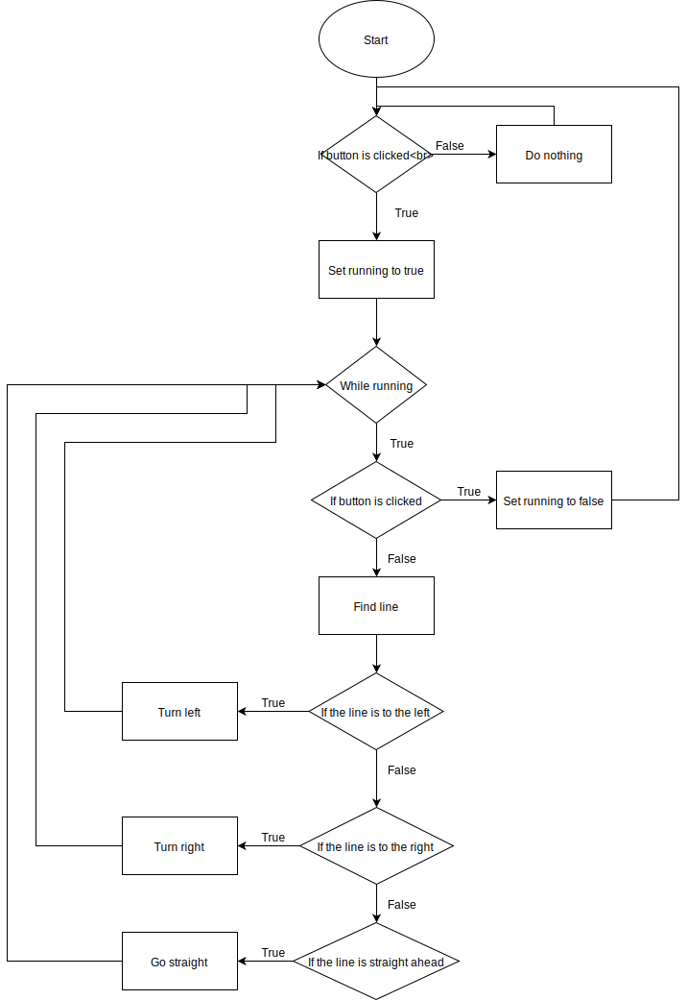

# Flæðirit og sauðakóði

Sauðakóði:
```
wait until button is pressed
	start running
		stop if the button is clicked
	find the line
		if the line is to the left
			turn left
		else if the line is to the right
			turn right
		else if the line is straight ahead
			go straight
```

